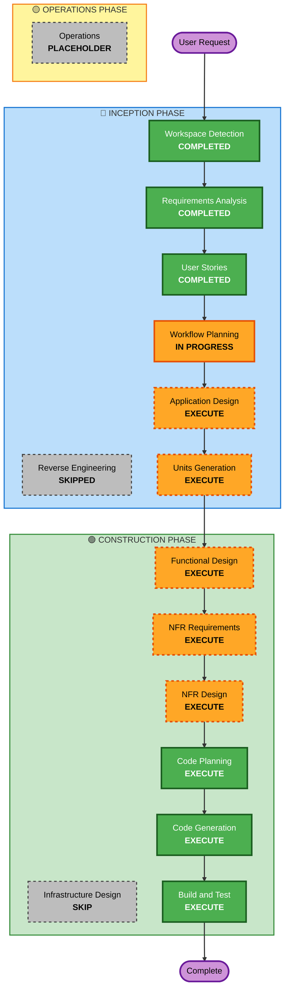

# Execution Plan

## Detailed Analysis Summary

### Project Context
- **Project Type**: Greenfield (new project)
- **Primary Request**: Build AI agent discussion web application in Python
- **Technology Stack**: Streamlit, Claude API, Python 3.9+, YAML configuration
- **Scope**: Single-user personal tool with moderate complexity

### Change Impact Assessment

#### User-facing Changes: YES
- **Description**: Entirely new user-facing web application with interactive UI
- **Components**: Topic input, persona selection, real-time discussion display, export functionality, history management
- **User Experience**: Complete new user experience from setup through discussion completion

#### Structural Changes: YES  
- **Description**: New application architecture with multiple integrated components
- **Components**: UI layer (Streamlit), AI integration layer (Claude API), persistence layer (local files), configuration management
- **Architecture**: Single-application architecture with clear separation of concerns

#### Data Model Changes: YES
- **Description**: New data models for discussions, personas, and configuration
- **Models**: Discussion metadata, agent personas, conversation history, export formats
- **Storage**: Local file-based storage (YAML config, JSON/Markdown exports)

#### API Changes: YES
- **Description**: New integration with external Claude API
- **Interfaces**: Claude API integration, local file system interfaces
- **Contracts**: API request/response handling, error management, rate limiting

#### NFR Impact: YES
- **Performance**: Real-time streaming requirements, UI responsiveness
- **Security**: API key management, input validation, secure file storage
- **Usability**: Simple interface, clear error messages, intuitive workflows
- **Reliability**: Graceful error handling, data persistence, configuration validation

### Risk Assessment
- **Risk Level**: Medium
- **Rationale**: Moderate complexity with AI API integration, real-time features, and multiple user workflows
- **Rollback Complexity**: Easy (new project, no existing dependencies)
- **Testing Complexity**: Moderate (UI testing, API integration testing, file persistence testing)

## Workflow Visualization

### Mermaid Diagram


### Text Alternative
```
INCEPTION PHASE:
1. Workspace Detection (COMPLETED)
2. Reverse Engineering (SKIPPED - Greenfield)
3. Requirements Analysis (COMPLETED)
4. User Stories (COMPLETED)
5. Workflow Planning (IN PROGRESS)
6. Application Design (EXECUTE)
7. Units Generation (EXECUTE)

CONSTRUCTION PHASE:
8. Functional Design (EXECUTE)
9. NFR Requirements (EXECUTE)
10. NFR Design (EXECUTE)
11. Infrastructure Design (SKIP)
12. Code Planning (EXECUTE - Always)
13. Code Generation (EXECUTE - Always)
14. Build and Test (EXECUTE - Always)

OPERATIONS PHASE:
15. Operations (PLACEHOLDER)
```

## Phases to Execute

### 🔵 INCEPTION PHASE
- [x] Workspace Detection (COMPLETED - 2026-03-12T21:19:32.732+09:00)
- [x] Reverse Engineering (SKIPPED - Greenfield project)
- [x] Requirements Analysis (COMPLETED - 2026-03-12T21:36:10.959+09:00)
- [x] User Stories (COMPLETED - 2026-03-13T13:16:43.940+09:00)
- [x] Workflow Planning (IN PROGRESS)
- [ ] Application Design - **EXECUTE**
  - **Rationale**: New application requires component design, service layer definition, and business rules specification for AI agent management, discussion flow, and data persistence
- [ ] Units Generation - **EXECUTE**
  - **Rationale**: Multiple integrated components (UI, AI integration, persistence, configuration) require structured breakdown into development units

### 🟢 CONSTRUCTION PHASE
- [ ] Functional Design - **EXECUTE**
  - **Rationale**: New data models needed for discussions, personas, and configuration; complex business logic for agent coordination and discussion flow
- [ ] NFR Requirements - **EXECUTE**
  - **Rationale**: Performance requirements for real-time streaming, security considerations for API key management, usability requirements for simple interface
- [ ] NFR Design - **EXECUTE**
  - **Rationale**: NFR patterns needed for streaming implementation, security patterns for API key handling, error handling patterns for graceful failures
- [ ] Infrastructure Design - **SKIP**
  - **Rationale**: Local desktop application with no cloud infrastructure or deployment architecture required
- [ ] Code Planning - **EXECUTE** (ALWAYS)
  - **Rationale**: Implementation approach needed for all components
- [ ] Code Generation - **EXECUTE** (ALWAYS)
  - **Rationale**: Code implementation needed for complete application
- [ ] Build and Test - **EXECUTE** (ALWAYS)
  - **Rationale**: Build, test, and verification needed for working application

### 🟡 OPERATIONS PHASE
- [ ] Operations - **PLACEHOLDER**
  - **Rationale**: Future deployment and monitoring workflows (not applicable for local desktop application)

## Estimated Timeline
- **Total Phases**: 10 phases to execute
- **Estimated Duration**: Medium complexity project with comprehensive design and implementation

## Success Criteria
- **Primary Goal**: Functional AI agent discussion application meeting all requirements
- **Key Deliverables**: 
  - Working Streamlit web application
  - AI agent persona management system
  - Real-time discussion streaming
  - Export and history functionality
  - Configuration management
- **Quality Gates**: 
  - All functional requirements implemented
  - All user stories satisfied
  - Security baseline compliance
  - Performance requirements met
  - Error handling validated
